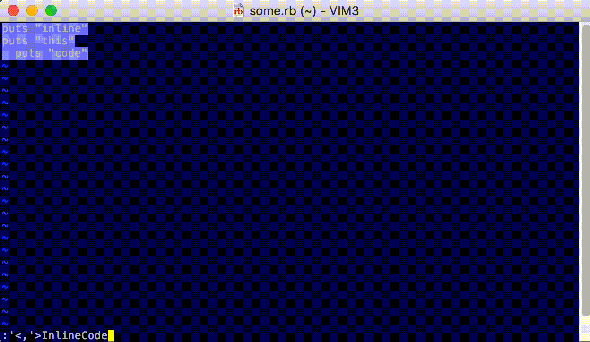

## vim-inline-code

Inline some code, which will be copied to your clipboard, then opened in a new buffer, so you can edit it further if so desired.

Simply select the code you'd like to convert to one line and run

`:'<,'>InlineCode`

### TODO

* Add InlineCodeWithSeparator
  * add semicolon to end of each line
* Add InlineCodeRubyModule
  * this will convert nested modules into One::Two syntax
* Add InlineCodeWithoutWindow possibly?
  * don't open a new pane, just copy to clipboard
